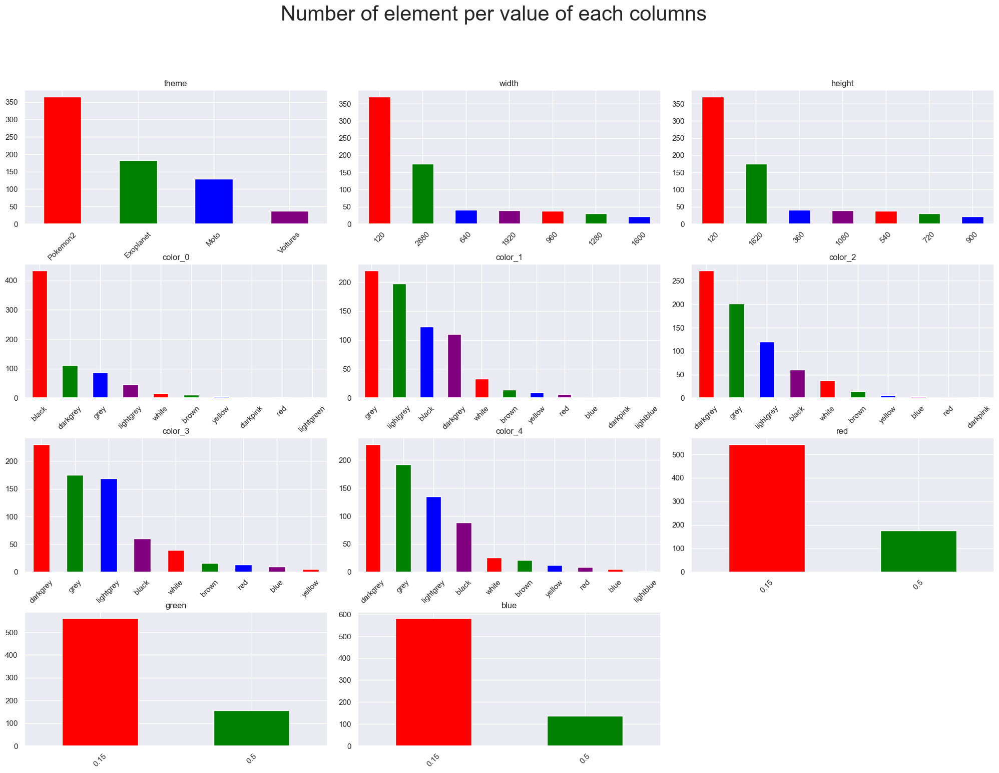

# Rapport de projet DATA MINING
**Joseph Pouradier-duteil & Pierre-Louis TELEP**
 
 

## Sommaire

- [Rapport de projet DATA MINING](#rapport-de-projet-data-mining)
  - [Sommaire](#sommaire)
  - [1. Introduction](#1-introduction)
  - [2. Présentation du projet](#2-présentation-du-projet)
  - [3. Présentation des données ](#3-présentation-des-données)
  - [4. Analyse des données `JO`](#4-analyse-des-données-jo)
  - [5. Prédiction](#5-prédiction)
  - [6. Auto-évaluation](#6-auto-évaluation)
  - [7. Remarques](#7-remarques)
  - [8. Conclusion](#8-conclusion)

 
 

## 1. Introduction 

Ce rapport a pour but de présenter le projet de Data Mining. Le projet a été réalisé par **Joseph POURADIER-DUTEIL** et **Pierre-Louis TELEP**. 

Le but de ce projet est de réaliser un système de recommandation. Un système de recommandation est un algorithme qui va analyser les données des images proposées à l'utilisateur. En fonction de si l'utilisateur aime ou pas les images l'algorithme va pouvoir proposer de nouvelles images et prédire si l'utilisateur va aimer ou non cette image. Pour cela nous avons utilisés des images de `Motos`,`Voitures`,`Pokemons` et `Exoplanet`. 

## 2. Présentation du projet

Ce projet a pour but de faire un système de recommandation. Pour cela nous avons utilisés des images de `motos`,`voitures`,`Pokémons` et `planètes`. Nous avons utilisés des images trouvées en ligne sur WikiData que nous avons ensuite analyser pour récuperer leurs [métadonnées](MetaData.ipynb). 

Pour la partie de recommandation nous avons utilisé `SKLearn` et les `DecisionTree` pour analyser les choix de l'utilisateur en fonction des images proposées et prédire des images qu'il aime ou pas. Nous avons fait un deuxieme modéle de recommandation mais basé sur des préférences utilisateur aléatoire. 
 
 
 
 
 
 
 
 
 

## 3. Présentation des données 

Nous sommes aller sur wikidata pour recupérer les images de `motos`,`voitures`,`Pokémons` et `planètes`. Pour télécharger les images nous avons utilisés un csv contenant les Urls des images. 

Pour ensuite télécharger les images nous avons utilisé un script [python](test.ipynb#téléchargement-des-images) qui va parcourir le csv et générer un dictionnaire contenant le nom de l'image, le dossier où enregistrer l'image, le lien pour téléchager l'image ainsi que certaines métadonnées. Ce même [script](test.ipynb#Wgets) va ensuite télécharger chaque image en utilisant `requests` avec des `get` et les enregistrer dans un dossier.

Une fois que toutes les images étaient téléchargées nous les avons utilisé un [script](images/Analizing_wh.ipynb) python pour les mettre les photo au même format. Pour cela nous avons utilisé `PIL` et `numpy` pour les redimensionner au format 16:9, les normaliser et les convertir en `RGB`.

## 4. Analyse des données `JO`
Meta data
Dataframe
gestion des couleurs

Après avoir récupéré toutes les images, nous avons récupéré leurs métadonnées.  
Nous avont utilisé les données exif des images tel que son theme, sa taille, son orientation quand elle était disponible et le format. Ensuite nous avons relevé les 5 coleurs prédominantes dans les images grace a l'algorithme de [K-means](MetaData.ipynb#Get-proiminant-colors-from-images). Par soucis de performance nous avons utilisé les K-means MiniBatch qui est une version plus rapide des K-means. Toutefois le resultat des K-means était en hexadecimal et nous donnais une trop grande diffusion des couleurs ( tres peu probable d'avoir deux fois la meme couleur meme parmis nos 720 images). Nous avons donc utilisé la fonction [color_hex_to_rgb](MetaData.ipynb#Transformation-de-hexa-a-RGB) pour convertir les couleurs en hexadecimal. Puis nous avon pris la couleur le plus proche dans un lot de 17 couleurs ([closest_color](MetaData.ipynb#Transformation-de-hexa-a-RGB)). Nous avons ensuite utilisé l'histogram des pixels rgb de chaque image pour en prendre une valeur normalisé entre 0 et 1: on fait une moyenne sur l'histogramme puis on prend la valeur normalisé de cette moyenne ([getDiagram](MetaData.ipynb#Getting-histogram-from-images)).  

Enfin nous avons écris toutes ces données dans un fichier json : [ExifDatatest2.json](images/ExifDatatest2.json)

On peut maintenant en visualiser la répartition des données sur un graphique:

## 5. Prédiction

## 6. Auto-évaluation
ff
## 7. Remarques
ff
## 8. Conclusion
ff